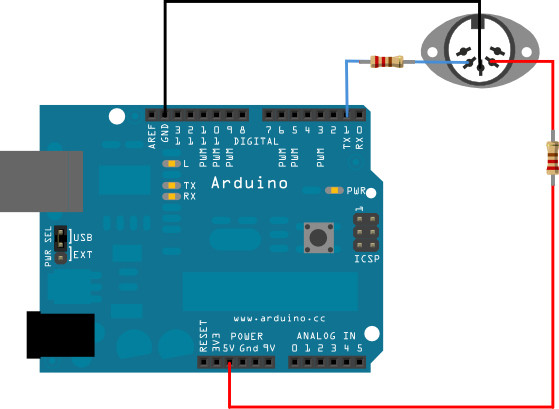
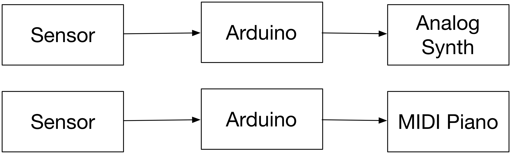
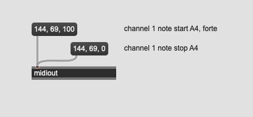
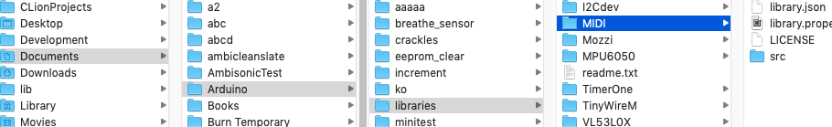
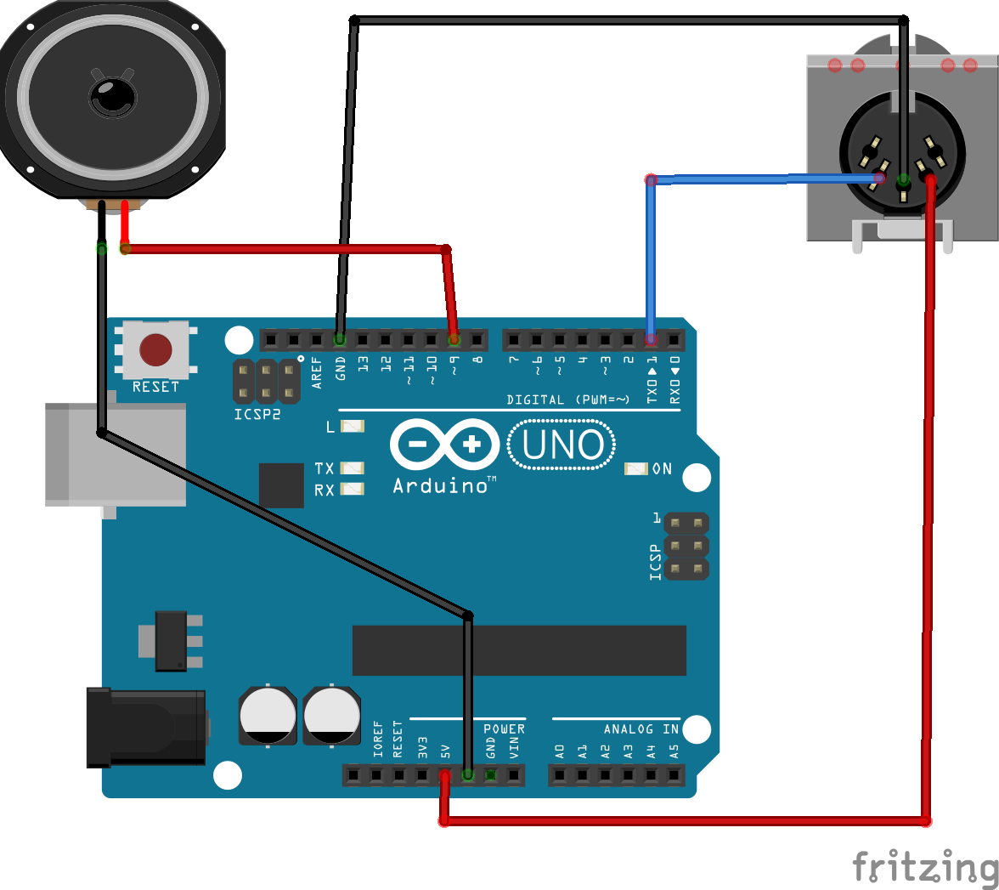

#Arduino und MIDI

## MIDI Hack

MIDI = Serial



2x 220 Ohm Widerstände

[Simple MIDI Player](https://www.arduino.cc/en/tutorial/midi)


## Anwendungsbeispiel




## MIDI Protokol

Baud Rate = 31250

Besteht aus drei Bytes

- Status Byte
- Data Byte1
- Data Byte2 

[MIDI Specification](https://www.midi.org/)  
[Status Byte](https://www.midi.org/specifications-old/item/table-2-expanded-messages-list-status-bytes)

## Experiment in Max



## Arduino MIDI Generator 1

```
void setup() {
  Serial.begin(31250);
}

void loop() {
  Serial.write(144);
  Serial.write(69);
  Serial.write(100);

  delay(500);

  Serial.write(144);
  Serial.write(69);
  Serial.write(0);

  delay(500);

}
```


## Arduino MIDI Generator 2

```

void setup() {
  Serial.begin(31250);
}

void loop() {

  note(random(64) + 25, random(64) + 64, random(200) + 10);
  random(200) + 10;
}


void note(byte pitch, byte vel, int dur)
{
  Serial.write(144);
  Serial.write(pitch);
  Serial.write(vel);

  delay(dur);

  Serial.write(144);
  Serial.write(pitch);
  Serial.write(0);
}


```

## Arduino MIDI Generator 3

```
int melody [] = {60, 60, 67, 67, 69, 69, 67};
int i = 0;

void setup() 
{
  Serial.begin(31250);
}

void loop() 
{
  for (int i = 0; i < 7; i++)
  {
    note(melody[i], 90, 400);
  }
  delay(100);
}

void note(byte pitch, byte vel, int dur)
{
  Serial.write(144);
  Serial.write(pitch);
  Serial.write(vel);

  delay(dur);

  Serial.write(144);
  Serial.write(pitch);
  Serial.write(0);
}
```


## Arduino MIDI Library 

This library enables MIDI I/O communications on the Arduino serial ports. You can send and receive messages of all kinds (including System Exclusive, RealTime etc..). The purpose of this library is not to make a big synthetizer out of an Arduino board, the application remains yours. However, it will help you interfacing it with other MIDI devices.

[MIDI Library](K1/https://github.com/FortySevenEffects/arduino_midi_library/releases/tag/4.3.1)


## MIDI Library

### Library Import



### MIDI Message


```
#include <MIDI.h>

MIDI_CREATE_DEFAULT_INSTANCE();

void setup() {
  MIDI.begin();
}

void loop() {

  MIDI.sendNoteOn(60, 90, 1);
  delay(300);
  MIDI.sendNoteOff(60, 90, 1);
  delay(300);

  MIDI.sendProgramChange(random(120), 1);
  
}
```

siehe keywords.txt

## Arduino als MIDI Empfänger


```
#include <MIDI.h>


MIDI_CREATE_DEFAULT_INSTANCE();

const byte ledPin = 13;

void setup()
{
    pinMode(ledPin, OUTPUT);
    MIDI.begin(1); //channel                    
}

void loop()
{
    if (MIDI.read()) // new message available?
    {
        switch(MIDI.getType())     
        {
            case midi::NoteOn:       
            {
                byte pitch = MIDI.getData1();
                if(pitch == 69)
                {
                  digitalWrite(ledPin, HIGH);
                }
                else
                {
                  digitalWrite(ledPin, LOW);
                }
                break;
            }
            default:
                break;
        }
    }
}
```

## Arduino als MIDI Synth

Mozzi + MIDI


```
#include <MIDI.h>

#include <MozziGuts.h>
#include <Oscil.h> 
#include <tables/saw2048_int8.h>
Oscil <SAW2048_NUM_CELLS, AUDIO_RATE> aSaw(SAW2048_DATA);

MIDI_CREATE_DEFAULT_INSTANCE();

void setup()
{
    startMozzi(64); 
    aSaw.setFreq(440);
    MIDI.begin(1);             
}

void updateControl()
{
    if (MIDI.read()) // new message available?
    {
        switch(MIDI.getType())     
        {
            case midi::NoteOn:       
            {
                int pitch = MIDI.getData1();
                float ex = float(pitch-69)/12;
                float freq  = pow(2, ex) * 440;
                aSaw.setFreq(freq );
            }
            default:
                break;
        }
    }
}

int updateAudio(){
    return aSaw.next();
}

void loop(){
    audioHook();
}
```
