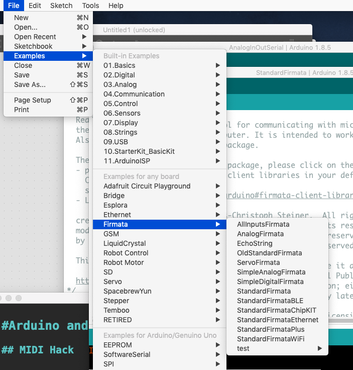
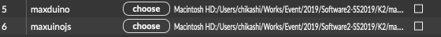
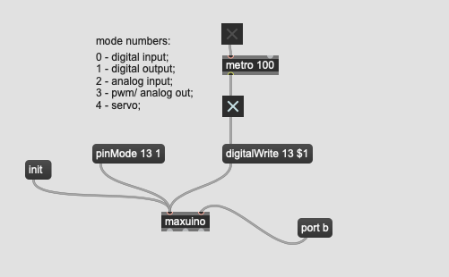
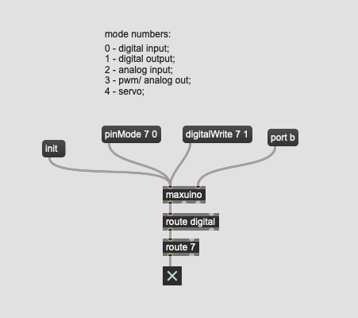
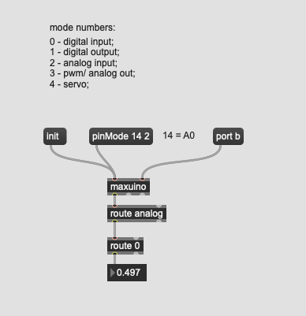

#Max Objekt für Arduino

## Bessere Optionen für Arduino + Max

[Arduino Playgroud](https://playground.arduino.cc/Interfacing/MaxMSP/)

## Firmata

Firmata is a protocol for communicating with microcontrollers from software on a host computer. The protocol can be implemented in firmware on any microcontroller architecture as well as software on any host computer software package. The Arduino repository described here is a Firmata library for Arduino and Arduino-compatible devices. If you would like to contribute to Firmata, please see the Contributing section below.

[Firmata](https://github.com/firmata/arduino#usage)

## Maxuino

Software connection between Cycling '74's Max, Arduino compatible hardware, and Ableton Live, through Firmata

[Maxuino](https://github.com/maxuino/maxuino)

## Einrichtung

Pfad

## Maxuino Beispiele

### LED

### Button

### Sensor

