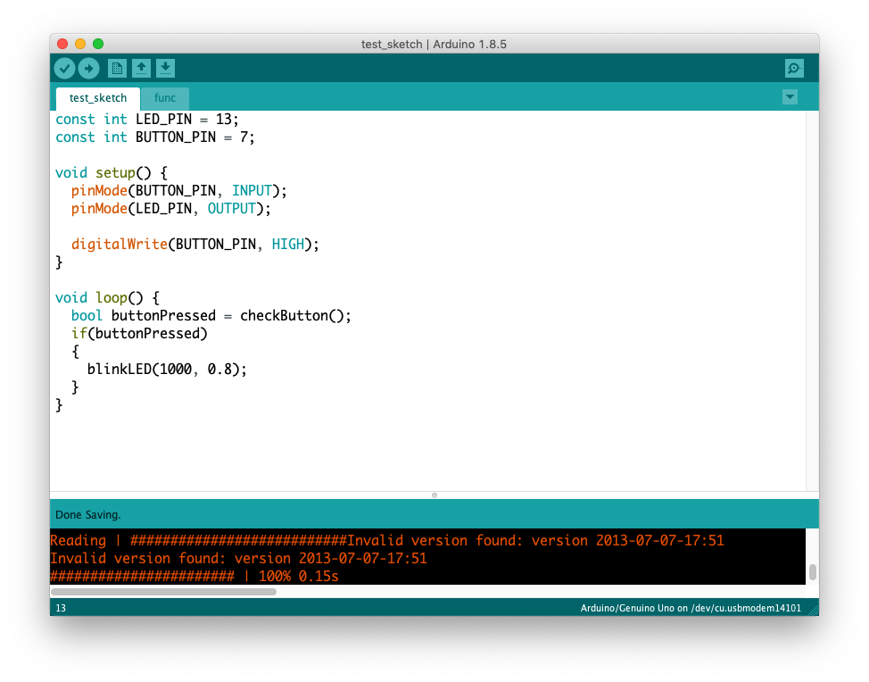
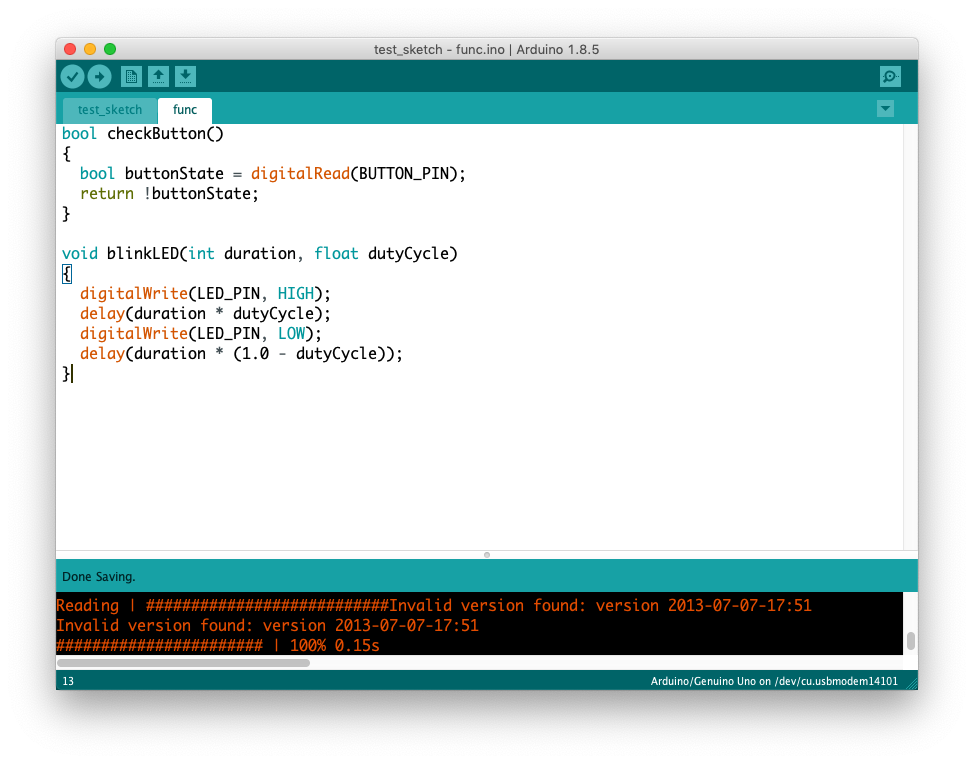

#Arduino und Programmierung

## 8 Tipps für Softwareentwicklung

### 1. git

#### Git hilft dir lebenslang

- Meiste Softwareentwickler benutzen git als VCS (Version Control System)
- Entwickelt von Linux Torvalds, der Gründer von Linux
- Vorteilhaft für alle Arten von Entwicklung (Max, SuperCollider)
- Auch gut als Backup system

[Wozu Versionskontrolle?](https://git-scm.com/book/de/v1/Los-geht%E2%80%99s-Wozu-Versionskontrolle%3F)


#### GitHub 

```
GitHub is a web-based hosting service for version control using Git. It is mostly used for computer code.  It offers all of the distributed version control and source code management (SCM) functionality of Git as well as adding its own features. 
```

#### Source Tree

[Source Tree App](https://www.sourcetreeapp.com/)

Git Client Software

### 2. Lesbarkeit

- Immer mit Cmd + T die Quellcode formatieren
- camelCase für Variabel
- const wenn möglich

#### camelCase
``` 
int selectedMode;
int pinNumber;
```

#### PascalCase
```
int SelectedMode;
int PinNumber;
```

#### snake_case
```
int selected_mode;
int pin_number
```

### Keine magic numbers

schlecht

```
digitalWrite(5, HIGH);
delay(100);
digitalWrite(5, LOW);
delay(100);
```

gut

```
const int LED_PIN = 5;
const int DELAY_DUR = 100;

digitalWrite(LED_PIN, HIGH);
delay(DELAY_DUR);
digitalWrite(LED_PIN, LOW);
delay(DELAY_DUR);
```

### 3. Datentyp

- bool/boolean ... true oder false
- byte ... 0 to 255
- int/short ... -32,768 to 32,768
- unsigned int ...  0 to 65,535
- long ...  -2,147,483,648 to 2,147,483,647.
- unsigned long ... 0 to 4,294,967,295
- float ... -3.4028235E+38 to 3.4028235E+38 

### 4. Funktion

Eine Funktionist ist die Bezeichnung eines Programmkonstrukts, mit dem der Programm-Quellcode strukturiert werden kann, so dass Teile der Funktionalität des Programms wiederverwendbar sind. Das besondere Merkmal einer Funktion (im Vergleich zum ähnlichen Konstrukt der Prozedur) ist, dass die Funktion ein Resultat direkt zurückgibt und deshalb in Ausdrücken verwendet werden kann. Die genaue Bezeichnung und Details ihrer Ausprägung sind in verschiedenen Programmiersprachen durchaus unterschiedlich.

Ohne Funktion

```
const int LED_PIN = 13;
const int DELAY_DUR = 100;

void setup() {
  pinMode(LED_PIN, OUTPUT);
}

void loop() {

  digitalWrite(LED_PIN, HIGH);
  delay(DELAY_DUR);
  digitalWrite(LED_PIN, LOW);
  delay(DELAY_DUR);
  
}
```

Mit Funktion

```
const int LED_PIN = 13;
const int DELAY_DUR = 100;

void setup() {
  pinMode(LED_PIN, OUTPUT);
}

void blinkLED()
{
  digitalWrite(LED_PIN, HIGH);
  delay(DELAY_DUR);
  digitalWrite(LED_PIN, LOW);
  delay(DELAY_DUR);
}

void loop() {
  blinkLED(); 
}
```

Funktion mit einem Parameter

```
const int LED_PIN = 13;
const int BLINK_DUR = 200;

void setup() {
  pinMode(LED_PIN, OUTPUT);
}

void loop() {
  blinkLED(BLINK_DUR); 
}

void blinkLED(int duration)
{
  digitalWrite(LED_PIN, HIGH);
  delay(duration / 2);
  digitalWrite(LED_PIN, LOW);
  delay(duration / 2);
}
```

Funktion mit mehreren Parameter

```
const int LED_PIN = 13;
const int BLINK_DUR = 1000;
const float DUTY_CYCLE = 0.8;

void setup() {
  pinMode(LED_PIN, OUTPUT);
}

void loop() {
  blinkLED(BLINK_DUR, DUTY_CYCLE); 
}

void blinkLED(int duration, float dutyCycle)
{
  digitalWrite(LED_PIN, HIGH);
  delay(duration * dutyCycle);
  digitalWrite(LED_PIN, LOW);
  delay(duration * (1.0 - dutyCycle));
}
```

Funktion mit Rückgabewert

```
const int LED_PIN = 13;
const int BUTTON_PIN = 7;
const int BLINK_DUR = 1000;
const float DUTY_CYCLE = 0.8;

void setup() {
  pinMode(BUTTON_PIN, INPUT);
  pinMode(LED_PIN, OUTPUT);

  digitalWrite(BUTTON_PIN, HIGH);
}

void loop() {
  bool buttonPressed = checkButton();
  if(buttonPressed)
  {
    blinkLED(BLINK_DUR, DUTY_CYCLE);   
  }
}

bool checkButton()
{
  bool buttonState = digitalRead(BUTTON_PIN);
  return !buttonState;
}

void blinkLED(int duration, float dutyCycle)
{
  digitalWrite(LED_PIN, HIGH);
  delay(duration * dutyCycle);
  digitalWrite(LED_PIN, LOW);
  delay(duration * (1.0 - dutyCycle));
}
```

### 5. Tab





### 6. Array

Mit Array kann man ähnliche Daten zusammenstellen und mit "for" iterieren.

```
int const NUM_SENSORS = 6;
int analogPins[NUM_SENSORS] = {A0, A1, A2, A3, A4, A5};
int analogIns[NUM_SENSORS];

void setup()
{
  Serial.begin(9600);
}

void loop()
{
  checkADC();
  int avg = calcAvg();
  Serial.println("Avg:" + String(avg) );
  delay(100);
}

void checkADC()
{
  for (int i = 0; i < NUM_SENSORS; i++)
  {
    analogIns[i] = analogRead(analogPins[i]);
    Serial.println(analogIns[i]);
  }
}

int calcAvg()
{
  int total = 0;
  for (int i = 0; i < NUM_SENSORS; i++)
  {
    total += analogIns[i];
  }
  return total / NUM_SENSORS;
}
```

### 7. Struct

```
const int INFRARED_SENSOR_PIN = A0;
const int KNOB_PIN = A1;
const int SLIDER_PIN = A2;

struct SensorData
{
  int knob;
  int slider;
  int infraredSensor;
};


void setup()
{
  Serial.begin(9600);
}

void loop()
{
  SensorData sensorData = checkADC();
  int avg = calcAvg(sensorData);
  Serial.println("Avg:" + String(avg/3));
  delay(100);
}

SensorData checkADC()
{
  SensorData sensorData;
  sensorData.infraredSensor = analogRead(INFRARED_SENSOR_PIN);
  sensorData.slider = analogRead(SLIDER_PIN);
  sensorData.knob = analogRead(KNOB_PIN);
  return sensorData;
}

int calcAvg(SensorData sensorData)
{
  int total = 0;
  total += sensorData.infraredSensor;
  total += sensorData.slider;
  total += sensorData.knob;
  return total;
}
```

### 8. Klasse

```
const int INFRARED_SENSOR_PIN = A0;
const int KNOB_PIN = A1;
const int SLIDER_PIN = A2;

class SensorManager
{
  public:
  void check()
  {
      infraredSensor = analogRead(INFRARED_SENSOR_PIN);
      slider = analogRead(SLIDER_PIN);
      knob = analogRead(KNOB_PIN);
  }
  
  int getAverage()
  {
      int total = 0;
      total += infraredSensor;
      total += slider;
      total += knob;
      return total / 3;
  }

  private:
  int knob;
  int slider;
  int infraredSensor;
};


SensorManager sensorManager;

void setup()
{
  Serial.begin(9600);
}

void loop()
{
  sensorManager.check();
  int avg = sensorManager.getAverage();
  Serial.println("Avg:" + String(avg));
}

```