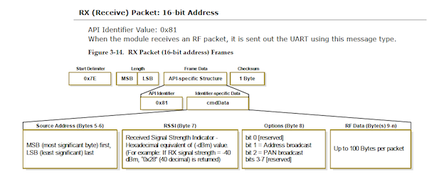

# Klasse 5, Goodbye Arduino

# Experiment 6: XBee + Arduino + POT

---
	int sensor = A0;

	void setup() {
  		Serial.begin(9600); 
	}

	void loop() {
  		int sensorValue = analogRead(sensor);
		  Serial.write(sensorValue/4);  
		  delay(50);
	}

---

=======

# Experiment 7: XBee + Knopf 

---------------------

### Modi
Es gibt zwei Modi

* AT Modus
* API Modus

#### AT Modus (default)
Zwei Xbee Antenne realisieren eine kabellose serielle (UART) Verbindung.

#### API Modus
Die Xbee Antenne funktioniert wie ein Arduino aber man kann nicht ein eigenen Programm auf die Antenne hochladen. 

Es gibt auch [Programmable Xbee](http://www.digi.com/products/wireless-wired-embedded-solutions/zigbee-rf-modules/zigbee-mesh-module/xbee-zb-module) aber sehr tauer.

### Moduswechsel

- ATAP = 0 … AT Modus
- ATAP = 2 … API Modus

#### Einstellung mit AT Command

##### Absender/Empfänger
|     |Xbee A       |Xbee B |
|-----|-------------|-------|
|atid |xxx          |xxx    |
|atmy |1            |2      |
|atdl |2            |1      |
|atap |2            |0      |
|atd0 |3 (DIN)      |       |
|atd1 |0            |       |
|atd2 |0            |       |
|atd3 |0            |       |
|atd4 |0            |       |
|atd5 |0            |       |
|atd6 |0            |       |
|atd7 |0            |       |
|atd8 |0            |       |
|atir |30           |       |

xxx … deine lieblingszahl

Wir benutzen nur Digital 0 als Digitaleingang. (atd0 = 1)
Der Wert von ATIR definiert das Intervall der Konvertierungen und Übertragung (default = 20)

### Binärsystem
[Wikipedia Binärsystem](http://de.wikipedia.org/wiki/Dualsystem)

###Analyse

Xbee Antenne (Empfänger) bekommen eine Liste wie folgende: 
126 0 10 131 0 1 36 0 1 0 1 0 1 81 

|Byte|Zahl|Funktion          |Bedeutung       |
|----|----|------------------|----------------|
|1   |126 |Start Delimiter   |                |
|2   |0   |Length (MSB)      |                |
|3   |10  |Length (LSB)      |16 bytes        |
|4   |131 |API Indentifier   |RX Packet:16-bit|
|5   |0   |Source Address    |                |
|6   |1   |Source Address    |Source address=1|
|7   |36  |Signal Strength   |                |
|8   |0   |Options           |No Options      |
|9   |1   |Number of Samples |1 sample        |
|10  |0   |Activated Ports   |                |
|11  |1   |Activated Ports   |D0 activated    |
|12  |0   |Data MSB          |                | 
|13  |1   |Data MSB          |D0 HIGH         |
|14  |84  |Check Sum         |                |

Check Sum:
131+0+1+36+0+1+0+1+0+1 = 171
255 - 171 = 84

### Decorder im Max Patch

---

###Zwei API Modi

ATAP 1 = API MODE
ATAP 2 = API MODE mit Escape

In API MODE mit Escape:
Wenn die Daten 126 beinhaltet, ersetzt Xbee sie durch 0.
126 ---> 0

---
# Experiment 8: XBee + POT 

##### Absender
|     |Xbee A       |Xbee B |
|-----|-------------|-------|
|atid |xxx          |xxx    |
|atmy |1            |2      |
|atdl |2            |1      |
|atap |2            |0      |
|atd0 |2 (AIN)      |       |
|atd1 |0            |       |
|atd2 |0            |       |
|atd3 |0            |       |
|atd4 |0            |       |
|atd5 |0            |       |
|atd6 |0            |       |
|atd7 |0            |       |
|atd8 |0            |       |
|atir |30           |       |

xxx … deine lieblingszahl

Xbee Antenne (Empfänger) bekommen eine Liste wie folgende: 
126 0 10 131 0 1 29 0 1 2 0 0 29 62

|Byte|Zahl|Funktion          |Bedeutung       |
|----|----|------------------|----------------|
|1   |126 |Start Delimiter   |                |
|2   |0   |Length (MSB)      |                |
|3   |10  |Length (LSB)      |16 bytes        |
|4   |131 |API Indentifier   |RX Packet:16-bit|
|5   |0   |Source Address    |                |
|6   |1   |Source Address    |Source address=1|
|7   |29  |Signal Strength   |                |
|8   |0   |Options           |No Options      |
|9   |1   |Number of Samples |1 sample        |
|10  |2   |Activated Ports   |A0 activated    |
|11  |0   |Activated Ports   |                |
|12  |0   |Analog MSB        |                | 
|13  |29  |Analog LSB        |                |
|14  |62  |Check Sum         |                |

### Decorder im Max Patch

Man kann verschiedenen Sensoren statt POT benutzen.

---

# E-Textil

[LilyPad Arduino](https://www.sparkfun.com/products/9266)

[How to LilyPad Arduino](http://lilypadarduino.org/)

[LilyPad Accessaries](https://www.sparkfun.com/categories/135)

---

# Name einer Antenne

- ATNI (Node Identifier) …  eine Antenne benennen (z.B. ATNI Tom)
- ATND (Node Descover) … Antenne im Netzwerk finden und eine Liste anzeigen 
	- Beispielantwort
		- 100 (MY address)
		- 13A200 (Serial Number HIGH)
		- 40A1640D (Serial Number LOW)
		- 26 (Signal Strength)
		- jerry (Name der Antenne)
- ATNT (Node Descover Time) … Die max. Dauer der Nachbarsuche
- ATDN … man kann den Empfänger der Nachrichte mit Name angeben. Dieser Befehl ändert automatisch den Wert von ATDL ab.
