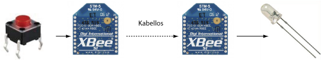
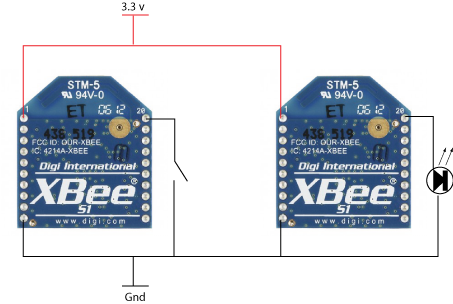
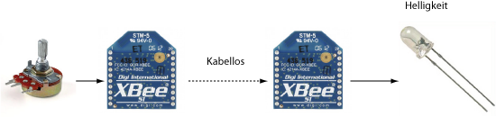
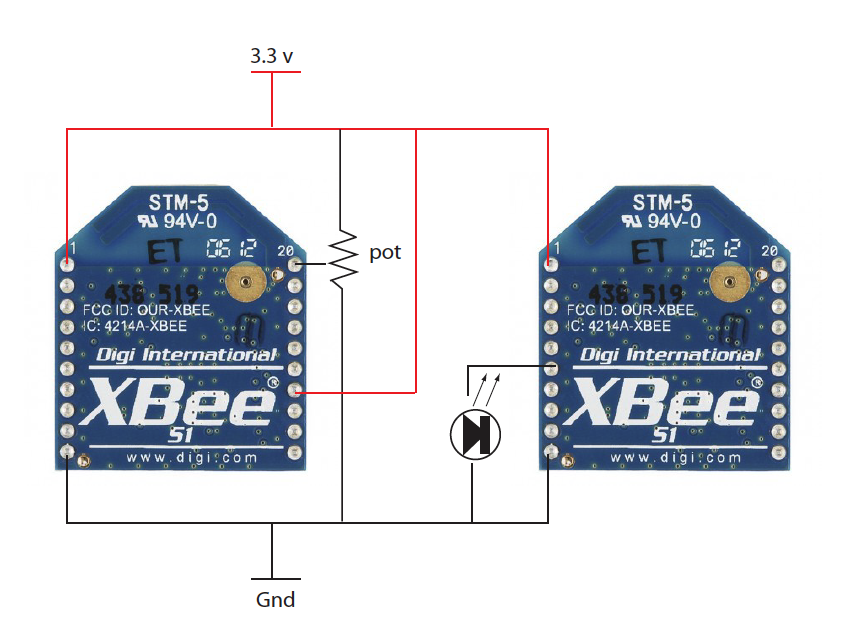

# Klasse 6, Weitere Funktionen

# Experiment 10: I/O Passing (Digital)

Man kann Xbee Antenne als unsichtbare Kabel benutzen.

### Ziel

### Stromkreis

### Absender/Empfänger

|     |Absender |Empfänger|
|-----|---------|---------|
|atid |xxx      |xxx      |
|atmy |1        |2        |
|atdl |2        |1        |
|atap |0        |0        |
|atd0 |3(input) |5(output)|
|atic |1        |0        |
|atiu |1        |0        |
|atia |         |1        |

xxx.. deine Lieblingsnummer

- ATIU ... IO Output Enable - Disables/Enables I/O data received to be sent out UART. The data is sent using an API frame regardless of the current AP parameter value. 

- ATIC ... IO Change Detect - Set/Read bitfield values for change detect monitoring. Each bit enables monitoring of DIO0 - DIO7 for changes. If detected, data is transmitted with DIO data only. Any samples queued waiting for transmission will be sent first.

- ATIA ... IO Input Address - Set/Read addresses of module to which outputs are bound. Setting all bytes to 0xFF will not allow any received I/O packet to change outputs. Setting address to 0xFFFF will allow any received I/O packet to change outputs.

# Experiment 11: I/O Passing (Analog)

Es gibt zwei PWM (Pulse Wave Modukation) Pins auf Xbee Antenne.
Man kann damit quasi-Analog Signal erzeugen.

### Ziel

### Stromkreis

### Absender/Empfänger
|     |Absender |Empfänger|
|-----|---------|---------|
|atid |xxx      |xxx      |
|atmy |1        |2        |
|atdl |2        |1        |
|atap |0        |0        |
|atd0 |2(AIN)   |5(output)|
|atic |1        |0        |
|atiu |1        |0        |
|atia |         |1        |
|atir |14(ms)   |         |
|atp0 |         |2        |

xxx.. deine Lieblingsnummer 

- ATIC ... IO Change Detect
- ATIA ... IO Input Address
- ATIU ... IO Output Enable

# References

[Official Document](http://www.digi.com/products/wireless-wired-embedded-solutions/zigbee-rf-modules/point-multipoint-rfmodules/xbee-series1-module#docs)

[Xbee Forum](http://www.digi.com/support/forum/questions/rf-gateways-and-drop-in-networking/ieee-802-15-4)

[Unofficial Xbee Cookbook](http://www.science.smith.edu/~jcardell/Courses/EGR328/Readings/XBeeCookbook.pdf)

[Xbee Example Project Von Digi](http://examples.digi.com/)

[Building Wire Sensor Networks](http://shop.oreilly.com/product/9780596807740.do)

