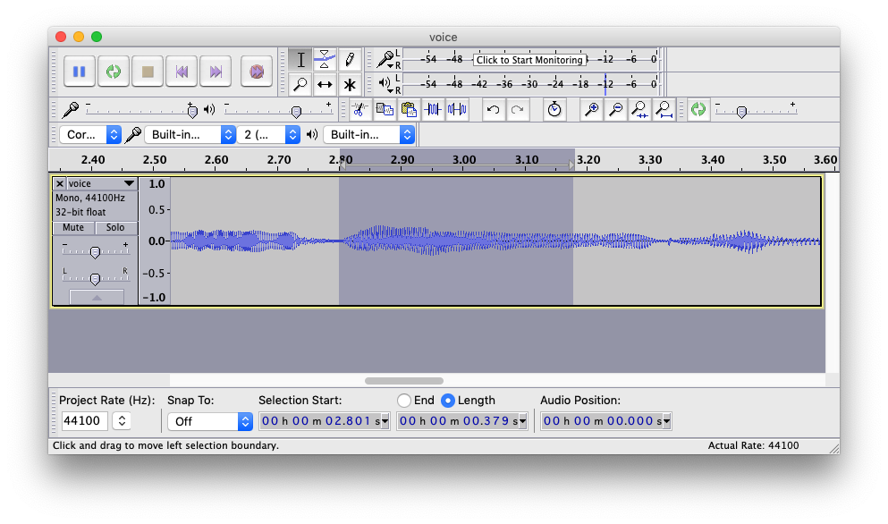
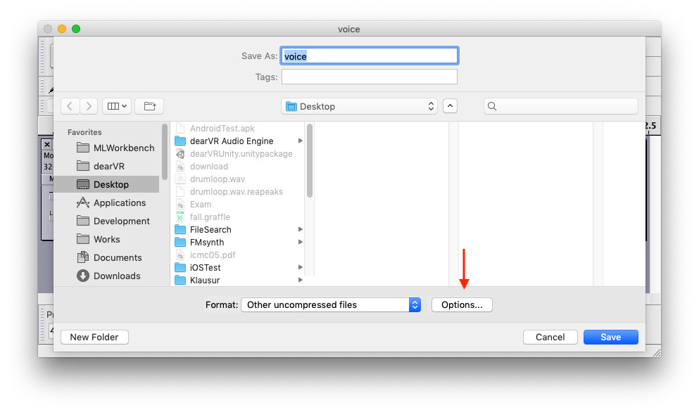
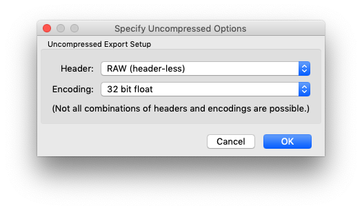
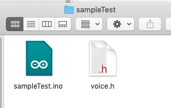
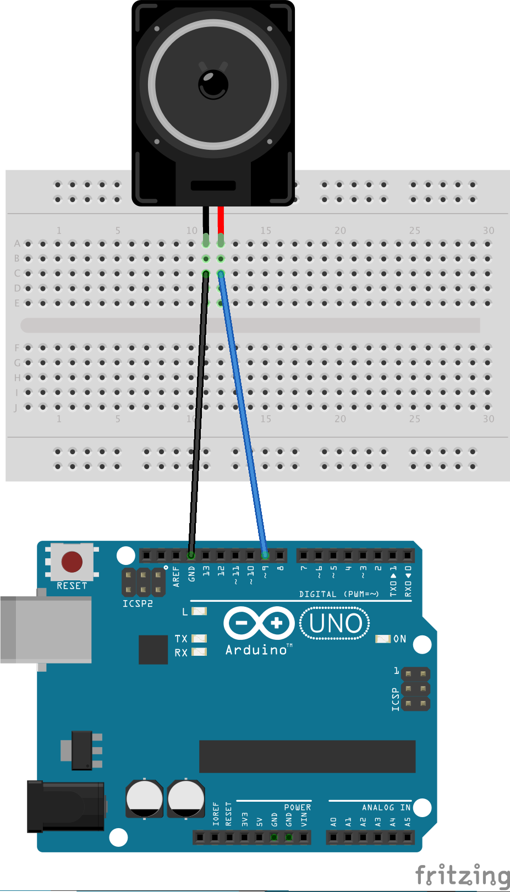

# Klasse 7 Arduino als Sampler

## Sample

[Mono WAV 44.1kHz 16bit 7 secs sample](K7/voice.wav)

## Audacity RAW Audio





[Mono Raw Audio](K7/voice.raw)

Dauer < 1 Sek

## Python Script für Umwandlung

~/Document/Arduino/libraries/Mozzi/extras/float2mozzi.py


## Terminal 

```
> cd ~/Documents/Arduino/libraries/Mozzi/extras/python 
> python float2mozzi.py /Users/chikashi/Desktop/voice.raw ~/Desktop/voice.h voiceTabel 44100
```

[voice.cpp](K7/voice.h)


## voice.h in Projekt




## Arduino 

```
#include <MozziGuts.h>
#include <Sample.h> // Sample template
#include <EventDelay.h>
#include "voice.h"

#define CONTROL_RATE 64

// use: Sample <table_size, update_rate> SampleName (wavetable)
Sample <VOICE_NUM_CELLS, AUDIO_RATE> aSample(VOICE_DATA);

// for scheduling sample start
EventDelay kTriggerDelay;

void setup(){
  startMozzi(CONTROL_RATE);
  aSample.setFreq((float) VOICE_SAMPLERATE / (float) VOICE_NUM_CELLS); // play at the speed it was recorded
  kTriggerDelay.set(1500); // 1500 msec countdown, within resolution of CONTROL_RATE
}


void updateControl(){
  if(kTriggerDelay.ready()){
    aSample.start();
    kTriggerDelay.start();
  }
}


int updateAudio(){
  return (int) aSample.next();
}


void loop(){
  audioHook();
}


```


## Verbindung




