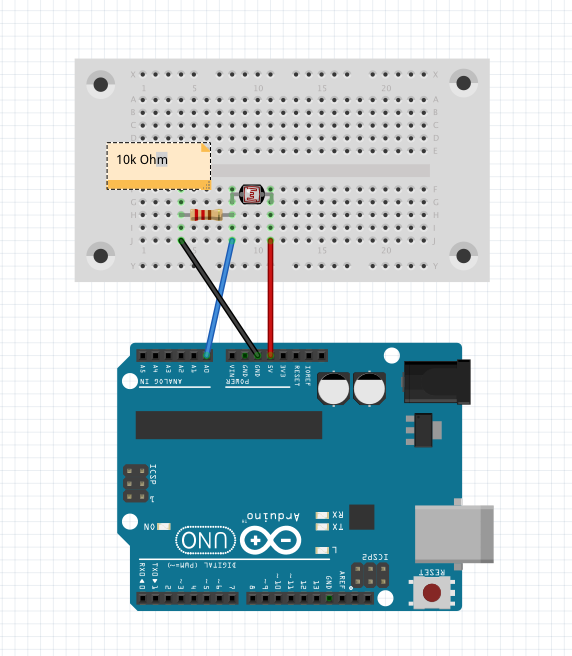
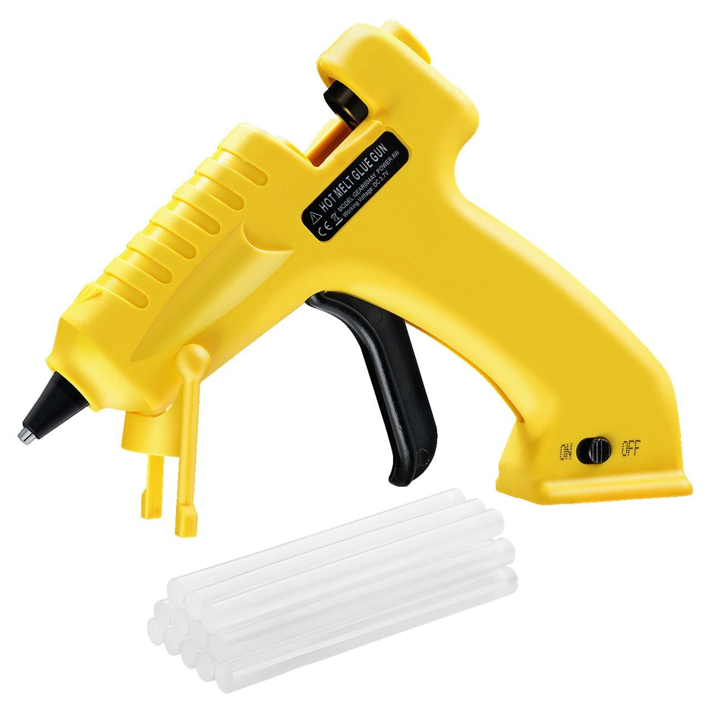
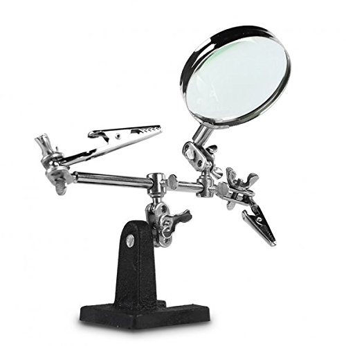
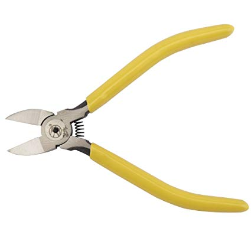
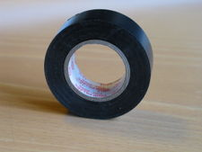

# Klasse 8 Werkzeuge für das Projekt

## Frizing

Fritzing ist eine freie Software, welche es ermöglicht, elektronische Schaltungen an einem Computer zu entwerfen. Ziel der Software ist es, Entwickler dabei zu unterstützen, ihre Projektideen in die Tat umzusetzen. Die Software wurde von Angehörigen der Fachhochschule Potsdam erstellt.

[Frizing Download](fritzing.org)

### Frizing GUI

## Shopping

[Exp Tech](https://www.exp-tech.de/)

[Watterott](https://www.watterott.com/)

[Reichelt](https://www.reichelt.com)

[Elmicro](https://elmicro.com/)

[Sparkfun Distributor]()
[Arduino Distributor](https://store.arduino.cc/distributors)

## Solderable Board

[SparkFun Solder-able Breadboard - Mini](https://www.exp-tech.de/zubehoer/breadboards/7293/sparkfun-solder-able-breadboard-mini)

## Wire

[Silicone Cover Stranded-Core Wire - 2m 30AWG Blue](https://www.exp-tech.de/zubehoer/kabel/litzendraehte-stranded-wire/6296/silicone-cover-stranded-core-wire-2m-30awg-blue)

## Glue gun/ Klebepistole

## Helping Hands

## Nipper / Kneifzange

## Electrical tape / Isolierband

